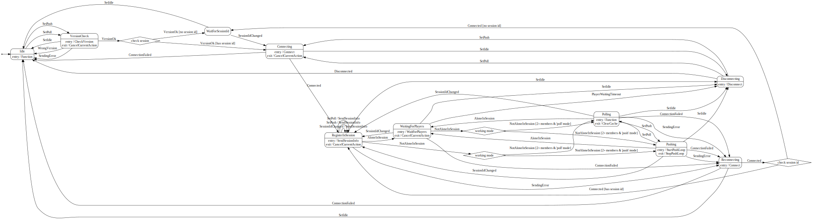

# HunterPie Sync Plugin

This is plugin for [HunterPie](https://github.com/Haato3o/HunterPie) that allows syncing monster buildup data from party-leader to other party members using central server.

## Installation

1. Drag'n'drop icon below to into HunterPie window:

    [](https://raw.githubusercontent.com/amadare42/HunterPie.SyncPlugin/master/Plugin.Sync/bin/Release/module.json)

2. Restart application

## Configuration

On first run, in plugin directory `config.json` file will be created. It will be loaded as configuration on plugin initialization.

`LogLevel`: set verbosity of plugin logging (Trace, Debug, Warn, Info, Error). Note that this will ignore core application settings. 

`ServerUrl`: change sync server url. Useful when using local server

It is also possible to configure server logging with `ServerLogging` object:
```
{
    Enable: true,
    Name: 'your-name',
    Room: 'room unique id to discern'
}
```

**What will be sent to server**: all plugin-related logs that user can see in application, along time, specified name.

## Build & Debug

Project is dependent on HunterPie.Core.dll binary. It will be referenced from `.\HunterPie\HunterPie.Core.dll` and `..\..\HunterPie\HunterPie\bin\<Debug|Release>\HunterPie.Core.dll` relative to project root (later have higher priority if present). If during build `.\HunterPie\HunterPie.Core.dll` is missing, build script will automatically download latest HunterPie release from GitHub.

In order to debug HunterPie with plugin, following steps may be taken to rebuild plugin on each HunterPie build:

1. Checkout this repository as sibling for HunterPie project repository
2. Add Plugin.Sync project as reference for HunterPie solution (optional, but highly recommended)
3. Add following line to post-build event for HunterPie project (including quotes):

    ```"$(MSBuildBinPath)\msbuild.exe" "$(ProjectDir)..\..\Plugin.Sync\Plugin.Sync\Plugin.Sync.csproj"```
4. Set "Run the post-build event" value to "Always", so module binaries will be updated for every build

After these steps, you can just edit plugin project inside HunterPie solution and will have latest binaries for each run so it is easily debbuggable.

### module.json can have placeholders that will be populated on build:

- `$hash:<filename>$`: SHA hash of file

- `$version:<filename>$`: version of file

- `$BRANCH$`: current branch name

## Sync server
Server source and communication protocol documentation can be found in it's [repository](https://github.com/amadare42/HunterPie.SyncPlugin.Server).

Client sync state machine map:

