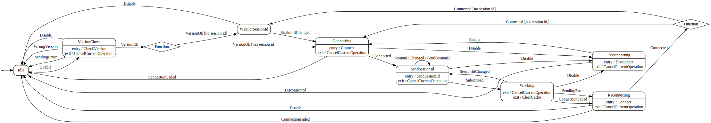

# HunterPie Sync Plugin

This is plugin for [HunterPie](https://github.com/Haato3o/HunterPie) that allows syncing monster buildup data from party-leader to other party members using central server.

> NOTE: this is in relatively early stage, but in working state.

## Installation

1. Drag'n'drop icon below to into HunterPie window:

[](https://raw.githubusercontent.com/amadare42/HunterPie.SyncPlugin/master/Plugin.Sync/bin/Release/module.json)

2. Restart application

## Configuration

On first run, in plugin directory `config.json` file will be created. It will be loaded as configuration on plugin initialization.

`LogLevel`: set verbosity of plugin logging (Trace, Debug, Warn, Info, Error). Note that this will ignore core application settings. 

`ServerUrl`: change sync server url. Useful when using local server

## Build & Debug

Due to HunterPie's plugin system, it can be a bit tricky to conveniently debug and rebuild project. Here are steps that are required to setup your environment to make it somewhat usable:

1. Checkout this repository as sibling for HunterPie project repository
2. Add Plugin.Sync project as reference for HunterPie solution (optional, but highly recommended)
3. Add following line to post-build event for HunterPie project (including quotes):

    ```"$(MSBuildBinPath)\msbuild.exe" "$(ProjectDir)..\..\Plugin.Sync\Plugin.Sync\Plugin.Sync.csproj"```
4. Set "Run the post-build event" value to "Always", so module binaries will be updated for every build

After these steps, you can just edit plugin project inside HunterPie solution and will have latest binaries for each run so it is easily debbuggable.

Synchronization 


### module.json can have placeholders that will be populated on build:

- `$hash:<filename>$`: SHA hash of file

- `$version:<filename>$`: version of file

- `$BRANCH$`: current branch name

## Sync server
Server source and communication protocol documentation can be found in it's [repository](https://github.com/amadare42/HunterPie.SyncPlugin.Server).

Poll (syncing as non-leader party member) operates using state-machine. Chart that describes it:



## Limitations and planned improvements

**Ailment buildup**

HunterPie doesn't allow to easily combine ailment timer from peer client with syncing process, so it is fetched from server instead. This increases data usage and makes UI updates less granular.

**Reflections usage**

In order to alter monster update flow, reflections used heavily. This is making updating process slower and less future-proof.

**Convoluted project structure**

Since plugin must have dependency on HunterPie project, it's impossible to just add this as an dependency for it for straight-forward build and debug. If HunterPie will be able to split plugin dependencies that are shared between application and plugin, required structure can be simplified.  

**Server protocol optimization** (DONE!)

**Websockets support** (DONE!)